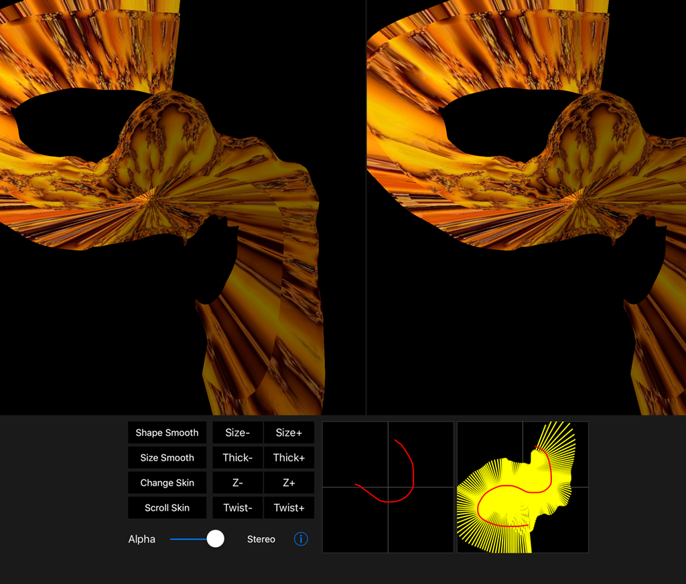

# MarchingCubes Terrain
Cross-eyed stereo rendition of the Marching Cubes algorithm, for others like me who can't get enough of 3D.

For newer iPads.

This little app lets you paint 3D shapes via the Marching Cubes algorithm.
The cube world dimension is 30x30x30.

Using the height control widget you select a particular Y axis level of the world,
then you paint flux levels in the companion X/Z view.

